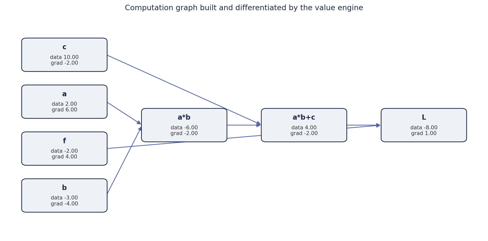

# micrograd — a tiny autograd engine, from scratch

[](https://colab.research.google.com/github/midhun9901/deep-learning-from-scratch/blob/main/01-micrograd/micrograd.ipynb)

A ~90-line automatic differentiation engine built from nothing — the same
reverse-mode backpropagation that powers PyTorch and TensorFlow, reduced to its
core idea. It works on single scalars so the mechanics stay visible, then a
small neural-network library is built on top of it.

## What it does

Every number is wrapped in a `value` that records how it was produced. Doing
maths on values builds a graph; calling `backward()` walks that graph in reverse
and fills in every gradient with the chain rule.

```python
a = value(2.0)
b = value(-3.0)
c = value(10.0)
L = a * b + c        # build an expression
L.backward()         # differentiate it
print(a.grad, b.grad, c.grad)   # dL/da, dL/db, dL/dc  ->  -3.0  2.0  1.0
```

## The idea in one picture

The graph below was built **and differentiated by the engine itself** (rendered
with `render_graph.py`, which loads the class straight from the notebook). Each
box shows a value's `data` and the `grad` that `backward()` computed for it:



Reading it left to right is the forward pass; the gradients are filled in right
to left, which is backpropagation.

## A neural net on top

With the engine in place, the notebook builds `Neuron → Layer → MLP`, exactly
the way real frameworks are structured. A 41-parameter MLP is then trained on a
tiny dataset with plain gradient descent (forward → `backward()` → nudge each
parameter by `-lr * grad`), and its predictions converge to the targets:

```
predictions: 0.98, -0.96, -0.95, 0.95
targets:     1.0,  -1.0,  -1.0,  1.0
```

## What I learned

- Backpropagation is not magic — it is one local derivative per operation, then
  the chain rule applied over a graph in reverse topological order.
- A deep-learning framework is really two small ideas: an autograd engine and a
  thin layer of `Module` classes that hold parameters.
- Why `zero-grad` matters: gradients accumulate (`+=`), so they must be reset
  each step.

## Limitations (on purpose)

Kept minimal so the core is easy to read:

- operates on scalars, not tensors (slow, but transparent);
- one activation (`tanh`) and the handful of ops needed for the demo.

These are the natural next extensions, not oversights.

## Run it

The engine itself has **zero dependencies** — only the Python standard library
(`math`, `random`). `matplotlib` is used solely to render the graph figure.

```bash
python render_graph.py     # regenerates assets/computation_graph.png
```

Or open the notebook (Colab badge above) and run top to bottom.

---

Built while working through Andrej Karpathy's *Neural Networks: Zero to Hero*,
reimplemented in my own code.
