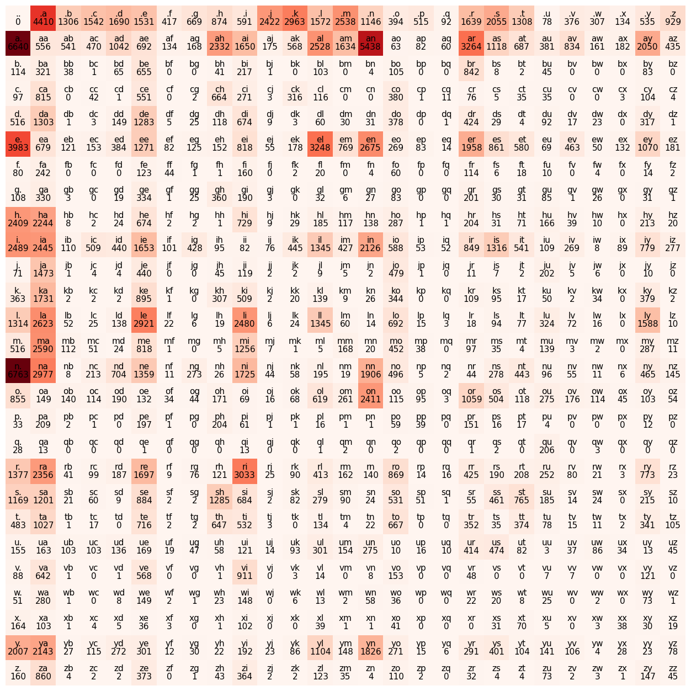

# makemore — bigram model

[](https://colab.research.google.com/github/midhun9901/deep-learning-from-scratch/blob/main/makemore-bigram/makemore-bigram.ipynb)

A character-level language model that learns to make up new names, trained on a
dataset of **32,033** real names. It is built **two ways** — by counting, and as
a neural network — and the point of the notebook is that these turn out to be the
same model.

## The idea

A bigram model predicts the next character from the current one. Take every name,
pad it with a start/end token `.`, and look at each adjacent pair of characters.

**Way 1 — counting.** Tally every character pair into a 27×27 matrix, then turn
each row into a probability distribution. To sample a name, start at `.` and keep
drawing the next character until you draw `.` again.



*Every character transition in the dataset. Bright cells are common — e.g. many
names start after `.` and end in `n.` — and this matrix **is** the model.*

**Way 2 — a neural network.** Encode the current character as a one-hot vector,
multiply by a 27×27 weight matrix `W`, softmax the result into probabilities, and
train `W` by gradient descent to minimise the negative log-likelihood.

## Results

Both approaches land in the same place, which is the whole lesson:

| Model | Average negative log-likelihood |
|-------|--------------------------------|
| Counting | **2.454** |
| Single-layer neural net | **2.458** |

Gradient descent rediscovers, from scratch, the same distribution the counts
gave directly. The generated names are only vaguely name-like — a bigram can only
see one character back — which is exactly the limitation that motivates the MLP
in [part 2](../makemore-mlp/).

## What I learned

- A **counting table and a one-layer neural network are the same model** — one is
  the closed-form answer, the other is found by optimisation.
- **Negative log-likelihood** as a loss, and why a little **smoothing** (`N + 1`)
  matters so no transition has zero probability.
- One-hot encoding followed by a matrix multiply is just a **lookup**.

## Limitations

Only the single previous character is used, so the model has no memory of anything
earlier in the name. That ceiling is the reason for moving to a context window and
an MLP next.

## Run it

Needs `torch` and `matplotlib`; `names.txt` is included in this folder.

```bash
jupyter notebook makemore-bigram.ipynb
```

---

Reimplemented from Andrej Karpathy's *Neural Networks: Zero to Hero*, in my own code.
