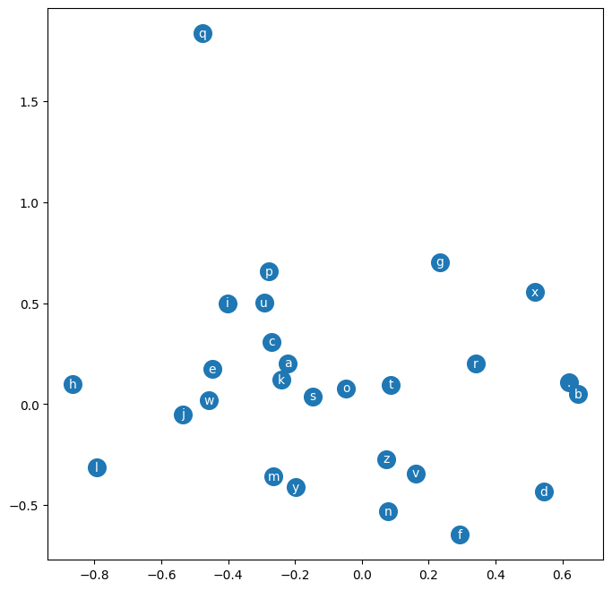

# makemore — MLP model

[](https://colab.research.google.com/github/midhun9901/deep-learning-from-scratch/blob/main/makemore-mlp/makemore-mlp.ipynb)

A character-level language model that predicts the next letter from the previous
**three**, using a small multi-layer perceptron with learned character
embeddings. This follows the classic Bengio et al. (2003) architecture and is a
direct step up from the [bigram model](../makemore-bigram/), which could only see
one character back.

## The idea

Each character is mapped to a small learned vector (an **embedding**). Three of
these vectors — the context window — are concatenated and passed through a hidden
`tanh` layer, and the network outputs a probability over the 27 possible next
characters. The embeddings, hidden layer, and output layer are all trained
together by gradient descent.

```
[c1 c2 c3] --embed--> vectors --concat--> hidden (tanh) --> softmax over 27 chars
```

Because characters are represented as vectors, the model can **generalise across
similar characters** — something one-hot encoding cannot do. Plotting the learned
vectors shows related characters landing near one another:



*A 2-D view of the learned character embeddings. The model was never told which
letters are related — it works this out from the training data.*

## Results

Trained on the same 32,033 names with an 80/10/10 train/dev/test split; **11,897
parameters**; minibatch SGD with a stepped learning rate (0.1 → 0.01).

| Model | Held-out loss |
|-------|--------------|
| Bigram (part 1) | 2.45 |
| MLP (this) | **2.13** |

The extra context and the learned embeddings give a clear improvement, and the
loss is measured on **held-out** names the model never trained on.

## What I learned

- **Embeddings**: representing discrete tokens as learned vectors lets the model
  share what it knows between similar characters.
- A fixed **context window + MLP** captures structure a bigram simply cannot.
- Using a **train/dev/test split** to measure real generalisation, and a quick
  **learning-rate search** to pick a sensible step size.

## Limitations

The context is fixed at three characters, so the model still cannot use anything
further back in the name. Growing that context cheaply is what later architectures
(RNNs, and eventually attention / a GPT) are for.

## Run it

Needs `torch` and `matplotlib`; `names.txt` is included in this folder.

```bash
jupyter notebook makemore-mlp.ipynb
```

---

Reimplemented from Andrej Karpathy's *Neural Networks: Zero to Hero*, in my own code.
